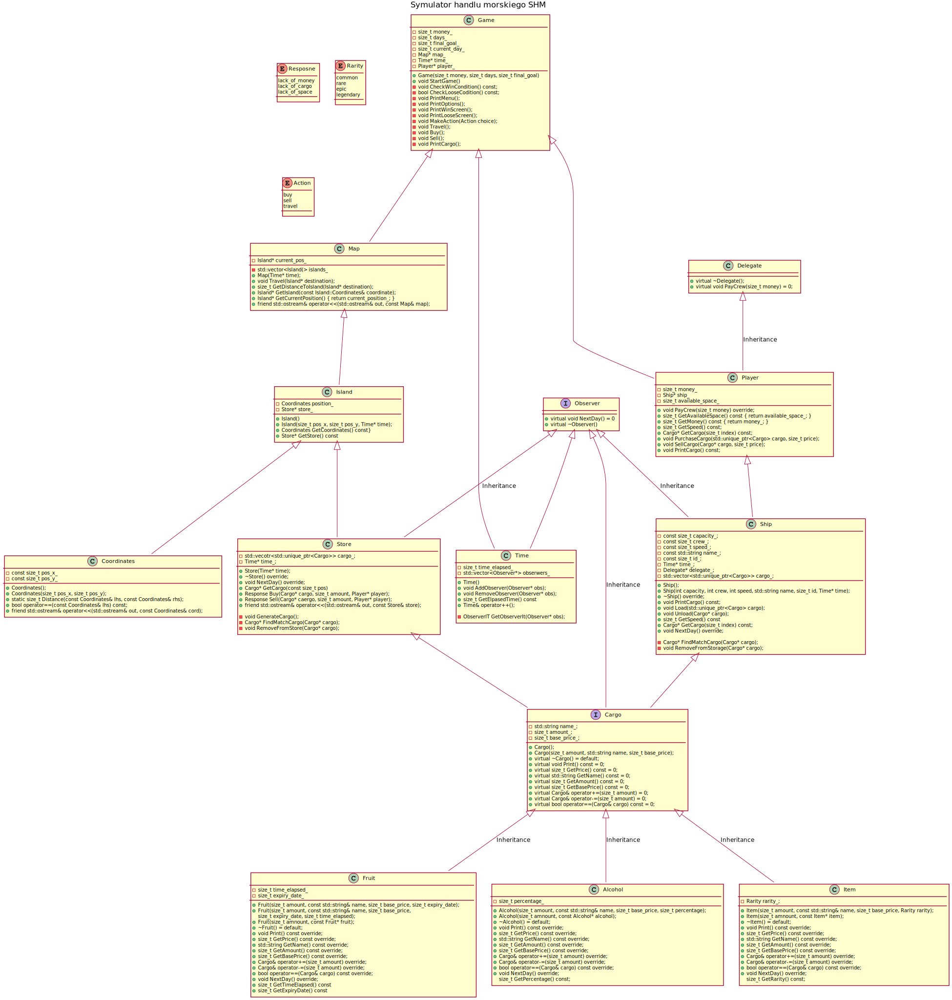

<!-- .slide: data-background="#111111" -->

# Programowanie obiektowe

## Kompozycja vs agregacja

<a href="https://coders.school">
    
</a>

___

## Relacja zawierania

Nic nie stoi na przeszkodzie, by jeden obiekt składał się z innych obiektów. W ten sposób sprawiamy, że struktura naszego kodu staje się bardziej zrozumiała.

Zawieranie się jednego obiektu w drugim nazywa się kompozycją lub agregacją. Nie są to synonimy, są to dwa trochę inne typy zawierania obiektów, ale obecnie to nie jest istotne. Dla przykładu z komputerem:
<!-- .element: class="fragment fade-in" -->

```cpp
class Computer {
    Processor processor_;
    Drive drive_;
    Motherboard motherboard_;
    GraphicsCard graphics_card_;
    Memory memory_;
    // ...
};
```
<!-- .element: class="fragment fade-in" -->

Komputer składa się (jest skomponowany) z procesora, napędu, płyty głównej, karty graficznej, pamięci.
<!-- .element: class="fragment fade-in" -->

___
<!-- .slide: data-background="#eeeeee" style="font-size: 0.95em; color: #333" -->

### Diagram klas - kompozycja vs agregacja
<!-- .element: style="color: #333" -->


* <!-- .element: class="fragment fade-in" --> Kompozycja: Samochód (Car) zawiera dokładnie 1 Gaźnik (Carburetor). Gaźnik jest częścią dokładnie jednego samochodu. Bez samochodu gaźnik nic nie robi, nie może więc działać bez niego.
* <!-- .element: class="fragment fade-in" --> Agregacja: Staw (Pond) może zawierać dowolną liczbę (0..*) Kaczek (Duck). Kaczka może być w danej chwili tylko w jednym stawie lub w żadnych (0..1). Kaczka może żyć poza stawem.

[Diagram klas - wikipedia](https://en.wikipedia.org/wiki/Class_diagram)
<!-- .element: class="fragment fade-in" -->

___

## SHM — Symulator Handlu Morskiego


___
<!-- .slide: data-background="#eeeeee" -->

### SHM - Diagram UML
<!-- .element: style="color: #333" -->

<a href="../shm-uml.svg">
    
</a>
