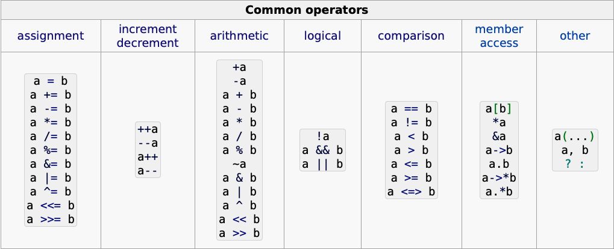

<!-- .slide: data-background="#111111" -->

# Programowanie obiektowe

## Operatory

<a href="https://coders.school">
    
</a>

___
<!-- .slide: style="font-size: 0.8em" -->

### Operatory

Operatory to specjalne funkcje. Specjalne, bo można je wywołać za pomocą określonego w nazwie operatora. Popatrz na przykład.
<!-- .element: class="fragment fade-in" -->

```cpp
class Person {
    const std::string name_;
    unsigned age_;

public:
    Person(const std::string & name, unsigned age)
        : name_(name), age_(age)
    {}

    unsigned getAge() const { return age_; }
    Person& operator++() {
        age_++;
    }
};
```
<!-- .element: class="fragment fade-in" -->

```cpp
int main() {
    Person adam("Adam", 25)
    ++adam;
    std::cout << adam.getAge() << '\n'; // prints 26
}
```
<!-- .element: class="fragment fade-in" -->

___

### `operator+=`

```cpp
T& T::operator +=(const T2& b);
```
<!-- .element: class="fragment fade-in" -->

#### Przykład implementacji
<!-- .element: class="fragment fade-in" -->

```cpp
Computer& Computer::operator+=(Memory amount) {
    ramAmount_ += number;
    std::cout << "Ram memory extended\n";
    return *this;
}
```
<!-- .element: class="fragment fade-in" -->

#### Przykład użycia
<!-- .element: class="fragment fade-in" -->

```cpp
Computer hp{};  // default configuration
hp += Memory{8_GB};
```
<!-- .element: class="fragment fade-in" -->

___

### Złe praktyki

Tego nie rób:
<!-- .element: class="fragment fade-in" -->

```cpp
Computer Computer::operator+=(Memory amount) {
    ramAmount_ -= amount;
    std::cout << "Ram memory extended\n";
}
```
<!-- .element: class="fragment fade-in" -->

Powyższy kod zawiera 3 błędy.
<!-- .element: class="fragment fade-in" -->

* <!-- .element: class="fragment fade-in" --> Wewnątrz operatora <code>+=</code> użyliśmy <code>-=</code>. Nikt nie spodziewa się takiego zachowania. Brakuje tylko komentarza <code>// happy debugging</code>
* <!-- .element: class="fragment fade-in" --> Brakuje nam <code>return *this</code>. W końcu coś zwracamy, prawda? Kompilatory na szczęście ostrzegają przed tym problemem.
* <!-- .element: class="fragment fade-in" --> Zwracamy kopię. <code>operator+=</code> powinien zwracać referencję do obiektu, aby działał tak jak każdy inny standardowy <code>operator+=</code>

___

### Jakie są operatory?

Mamy ich całkiem sporo
<!-- .element: class="fragment fade-in" -->



[Zobacz operatory na cppreference.com](https://en.cppreference.com/w/cpp/language/operators)
<!-- .element: class="fragment fade-in" -->

___

### Ciekawostka #1

Operatory możesz też wywołać pisząc "nazwę funkcji".
<!-- .element: class="fragment fade-in" -->

```cpp
Computer hp{};                  // default configuration
hp += Memory{8_GB};
hp.operator+=(Memory{8_GB});    // equal to above
```
<!-- .element: class="fragment fade-in" -->

___

### Ciekawostka #2

Możesz przeciążyć (zaimplementować) prawie każdy operator, z wyjątkiem:
<!-- .element: class="fragment fade-in" -->

* <!-- .element: class="fragment fade-in" --> <code>.</code>
* <!-- .element: class="fragment fade-in" --> <code>.*</code>
* <!-- .element: class="fragment fade-in" --> <code>::</code>
* <!-- .element: class="fragment fade-in" --> <code>?:</code>
* <!-- .element: class="fragment fade-in" --> <code>#</code>
* <!-- .element: class="fragment fade-in" --> <code>##</code>
* <!-- .element: class="fragment fade-in" --> <code>sizeof</code>
* <!-- .element: class="fragment fade-in" --> <code>typeid</code>
